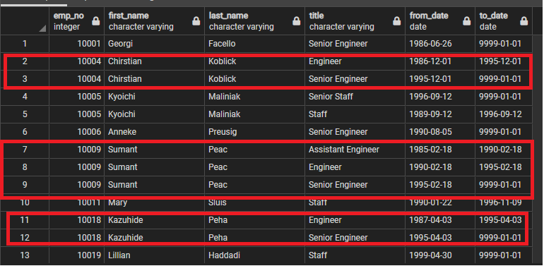

# _Time For An Upgrade: Retirement Is *Nigh*!_ || Pewlett Hackard Employee Database Analysis

## Overview of Project

Pewlett Hackard, a large and long-standing company is taking an active approach as it will soon experience an imminent event—dubbed the _"silver tsunami”_ essentially, a mass retirement of its older employees. 

With this mass exodus, Pewlett Hackard will lose a significant amount of its workforce. 

In preparation, to keep track of the former it was decided that an overhaul in record-keeping, transitioning from VBA and Excel to SQL databases would be most efficient and effective for the company’s Human Resource Department needs. 

Analysis of present employee records (data) to build an employee database via SQL, including script based of of specific  criteria, were done from six existing CSV files to address the following questions:

    (1) How many employees, specifically, born between January 1, 1962 and December 31, 1965 will retire?  
        a. Subsequently, _who_ will _need_ retirement packages?

    (2) What roles will need to be filled in the future? 
        a. From which departments? 

    (3) Will a mentorship program _help_ with these transitional roles?

## Resources

• Data Source(s): .CSV files can be accessed under the [Data](https://github.com/SoWhitIs/pewlett-hackard-analysis/tree/main/data) folder

• Scripts: [Queries](https://github.com/SoWhitIs/pewlett-hackard-analysis/tree/main/queries) folder

• Software: PostgreSQL | pgAdmin

## Results

### What we can _tell?_
* Notably, the majority or approximately **64%** of workforce retiring hold senior-level positions, i.e., Senior Engineer, Senior Staff.

  <i><b> Retirement By Title, Count</b></i> 
 

  

* With a difference of **4,900** employees or **11%**, respectively, there are nearly the same amount Engineering positions as there are Staff positions becoming vacant. 

* Creating a new table ([unquie_titles](data/unique_titles.csv)) to accurately  account for each individual employee, illustrated employees changed positions during their tenure. In fact out of **133, 776** "dups" or duplicate entries ntires on record, over **43,000** employees transitioned to new roles within the company. 

  <i><b> Multiple Roles</b></i> 
 

  

 
## Summary 

There are close to 94,400 roles slated to re-open. To examine this further, the following script was created (to construct a new table) to gain additional insights as to which titles, per department by (pending) retiree count. Full breakdown of retiring by department and title count [here.](data/_retiring_dept.csv). 

    --Filter Per Department, by Title, by Count

    SELECT COUNT(ut.emp_no), ut.title, d.dept_name 
    INTO retiring_dept
    FROM unique_titles as ut
    INNER JOIN dept_emp as de
    ON (ut.emp_no=de.emp_no)
    INNER JOIN departments as d
    ON (de.dept_no = d.dept_no)
    GROUP BY (d.dept_name, ut.title);

  <i><b> Retiree Count by Department and Title</b></i> 
 

  

While there is a pool of over 1500 varied and experieced qualified candidates for a potential mentorship program, unfortunately there is,simply,  _not_ enough to service the influx of Pewlett Hackard's expectant tally of new-hires. 
 
A recommendation would be to expand the mentorship criteria to garner like candidates, who perhaps, have been with the company for shorter amount years (i.e., 5 to 15 years), widen the birthdate range, or even reach out to those who have since, or in recent retired. 

#### Author

_Whitney D. Gardner_
